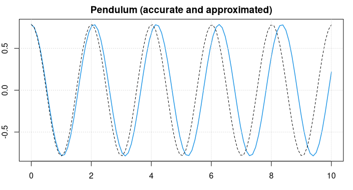

----

# JuliaCall: Integrating R and Julia

#### Contents

  * Introduction and Installation
  * Basic Usage
  * Computing with JuliaCall
  * Plotting
  * Application Examples
  * Differential Equations
  * Optimization
  * Appendix

----

## Differential Equations

### The 'diffeqr' Package

Julia is extremely strong in the area of Differential Equations (DE), due mostly to Chris Rakaukas and his [DifferentialEquations](https://diffeq.sciml.ai/v2.0/) package. Its documentation is almost a textbook on all types of differential equations, and is recommended to all people interested in solving differential equations numerically.

One could apply JuliaCall to solve differential equations through this interface. Instead Chris has provided the R package [diffeqr](https://cran.r-project.org/package=diffeqr) that makes use of JuliaCall, but provides a nicer way of solving differential equations by employing the Julia package. When getting installed, this package imports JuliaCall anyway. Precompiling the package may take a few moments.

```r
# library(diffeqr)
de <- diffeqr::diffeq_setup()
```


### ODEs (Ordinary DEs)

To solve a differential equation $y' = f(t,y)$ one has to define the function $f$, an initial condition $y_0$, and a time span $[t_0, t_e]$ to solve over. The result will be a vector (or matrix) of function values $y$ at certain time points $t$ in the interval.

We will look at a simple example. The following equation $y' = y^2 - y^3$ describes the flaring of a spark until it burns in a stable flame. $y^3$ is the volume in which oxygen gets burnt, and $y^2$ is proportional to the surface through which new oxygen can flow into the flame.

```r
f <- function(u, p, t) p[1]*u^2 - p[2]*u^3
p <- c(1.0, 2.0)
u0 <- 1/250             # initializing flare, in cm
tspan <- c(0.0, 500)    # time span in milliseconds

# Define and solve the DE problem
prob <- de$ODEProblem(f, u0, tspan, p)
sol  <- de$solve(prob, de$Tsit5(), reltol = 1e-08,
                 saveat=seq(0, 500, by=2.5))
```

Here $p$ is a (set of) parameter(s) to adapt the defining function $f$ to different situations. In `de$ODEProblem` it can be left off, in `f` not, but need not be used in the function body.

Now we can plot the solution (in R). The time (the independent variable) is stored in `sol$t`, the dependent values in `sol$u` (and always named `u`).

```r
par(mar=c(2,2,2,1))
plot(sol$t, sol$u, type='l', col=2, lwd=2,
     main = "Flaring of a spark into a burning flame")
grid()
```


We can see how the spark develops for some time before it burst suddenly into a flame and gets stable within a very short time period. 

`saveat` tells the solver, at which points to return solution values. For more information, for instance about how to involve `reltol` and `abstol`, see the vignettes of the *diffeqr* package. `Tsit5` is the default solver for non-stiff ODE problems, for stiff problems the `Rosenbrock23` solver is recommended.

For a list of solvers see the [ODE solvers](https://diffeq.sciml.ai/v2.0/solvers/ode_solve.html) page of the *DifferentialEquations* documentation. A selected solver like `Tsit5` will be called with `sol = de$solve(prob,de$Tsit5())`.


### Systems of Equations

The **Lotka-Volterra** equations attempt to describe the dynamics of biological systems in which two species interact, one as a predator and the other as prey. It is assumed that the habitat is largely isolated.

The model consists of two intermingled differential equations of first order.

$$
  y1' = p_1 \, y_1 + p_2 \, y_1 y_2
$$
$$
  y2' = p_3 \, y_2 + p_4 \, y_1 y_2
$$

Here $y_1$ is the number of prey ('rabbits'), $y_2$ the number of predators ('foxes'). The coefficients characterize the interaction between the two species. For instance, $p_3$ should be negative as the predator will die out if there is no prey.


We define a function that returns the two derivatives:

```r
f <- function(u, p, t) {
    du1 <- p1 * u[1] + p2 * u[1] * u[2]
    du2 <- p3 * u[2] + p4 * u[1] * u[2]
    return( c(du1, du2) )
}
```

with parameters `p1, ..., p4` and time span `[0, 240]` (of weeks or months, for example) and an initial population of `y0 <- c(50, 15)` (in thousands, say).

```r
p1 <-  0.1;  p2 <- -0.01 
p3 <- -0.05; p4 <-  0.001
u0 <- c(50, 15)
tspan <- c(0, 240)
```

We assign the time point at which a solution shall be returned (to make the plotted function smoother) and call Julia's Differential Equation solver as before.

```
t <- seq(0, 240, by=2)

prob <- de$ODEProblem(f, u0, tspan)
sol <- de$solve(prob, rel.tol = 1e-08, saveat = t)

# Convert Julia object into an R matrix
y <- sapply(sol$u,identity)
```

For systems of equations the solution is returned as an array of arrays. We convert it into an R matrix with rows representing the time series solving the problem.

```r
par(mar=c(4, 2, 2, 1))
plot(0, 0, type = 'n', xlim = c(0, 250), ylim = c(0, 100),
     xlab = 'time', ylab = '',
     main = 'Solution to Lotka-Volterra equations')
grid()

lines(t, y[1, ], col = 3, lwd = 1.5)
lines(t, y[2, ], col = 2, lwd = 1.5)
```


The green line displays prey figures, the red line the predators. Both species develop in a periodic way, but the curves are not sine curves, actually they cannot be represented through elementary mathematical functions.


### Second-order Differential Equations

Differential Equations of second order, $y'' = f(t, y, y')$, cannot be solved directly, instead we solve them as a system of two first order equations with $y_1 = y, y_2 = y'$, rewritng the above equation as
$$
  y_1' = y_2
$$
$$
  y_2' = f(t, y_1, y_2)
$$

As an example, we look at a (mathematical) pendulum. Newtonian Physics tell us that the pendulum swings according to the equation
$$
  \frac{d^2 u}{dt^2} = - \frac{g}{L} \sin(u)
$$
where $g$ is the gravity acceleration (on earth), $L$ the length of the pendulum, and $u$ the elongation from the vertical direction.

```r
g <- 9.81  # [m/s^2]
L <- 1.0   # [m]
```

Following the 'trick' above function `f` looks as

```r
f <- function(u, p, t) {
    du1 <- u[2]               # u1' = u'  = u2
    du2 <- -g/L * sin(u[1])   # u2' = u'' = -g/L sin(u)
    return( c(du1, du2) )
}
```

We solve this system as we did before. Start with an elongation of 45 degrees (and no velocity) and observe for 10 seconds.

```r
u0 <- c(pi/4, 0)
tspan <- c(0, 10)
t <- seq(0, 10, length = 100)

prob <- de$ODEProblem(f, u0, tspan)
sol <- de$solve(prob, rel.tol = 1e-08, saveat = t)

# Convert Julia object into an R matrix
y <- sapply(sol$u,identity)
```

```
u <- y[1, ]     # elongation
v <- y[2, ]     # angular velocity

par(mar = c(3,2,2,1))
plot(t, u, type = 'l', col = 4, lwd = 1.5,
     main = "Pendulum (accurate and approximated)")
lines(t, pi/4 * sin(sqrt(g/L)*t + pi/2), lty = 2)
grid()
```



The pendulum swings back-and-forth with a frequency of about 2 seconds.

For small values of $u$ it holds that $\sin(u) \approx u$ and the differential equation reduces to $u'' = -g/L \, u$, and we know the symbolic solution $u = \sin(c_1 t + c_2)$ . Considering the starting conditions, the approximate solution will be
$u = \pi/4\, sin(\sqrt{g/L} \cdot t + \pi/2)$ .
This is plotted as a black, dotted line in the figure above.

We can see that the approximate solution is oscillating slightly faster.


