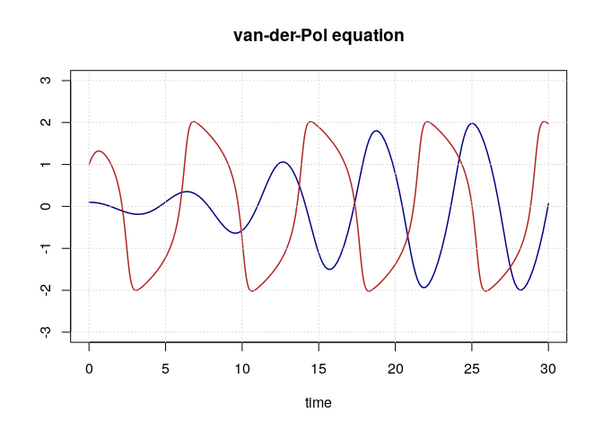

## Ordinary Differential Equation

An ordinary Differential Equation (of first order) is an expression

$$
  y' = f(t, y)
$$

where $y = y(t)$ is a function of the independent variable $t$ (or $x$) defined on an interval/a time span $[t_0, t_1]$ and satisfies an initial condition $y(t_0) = y_0$. Numerically the result shall be a vector (or matrix) of function values $y$ at certain time points $t$ in the interval.

The standard package for solving (ordinary) differential equations with R is **deSolve**. Alternatives are the **sundialsr** package or my own **pracma** package that encompasses several ODE solvers (written in pure R). We will use 'pracma', but the syntax is quite similar for all three packages.

### Example: flame

A spark flaring up to a flame (of some size $y$) follows the equation $y' = y^2 - y^3$, where $y^3$ is representing the volume where oxygen gets burnt, and $y^2$ the surface through which new oxygen can flow in.

#### First step: Define function `f` in R

Just write the right hand side $f$ as a function in R.


```r
flame <- function(t, y) y^2 - y^3
```

NOTE: The argument `t` is necessary though not used in the calculation.

#### Second step: Call the DE solver

Solvers in 'pracma' have names relating to corresponding solvers in MATLAB, such as `ode45`, `ode23`, or `ode23s`.


```r
sol <- pracma::ode45(flame, 0, 500, 1/250)  # ode23, ode23s
str(sol)
```

```
## List of 2
##  $ t: num [1:112] 0 5 61.8 119.4 157.3 ...
##  $ y: num [1:112] 0.004 0.00408 0.0053 0.00762 0.01067 ...
```

```r
cbind(sol$t[1:5], sol$y[1:5])
```

```
##           [,1]        [,2]
## [1,]   0.00000 0.004000000
## [2,]   5.00000 0.004081296
## [3,]  61.75143 0.005304131
## [4,] 119.43906 0.007621370
## [5,] 157.27441 0.010670698
```

#### Third step: Plot the solution

The numerical solution is stored in `sol` in list components `t` and `y`.These solvers are *adaptive*, that is they decide at which (time) points the solution values are calculated.


```r
plot(sol$t, sol$y, type = 'l', lwd = 2, col = "red",
     main = "Solution to the 'flame' problem")
points(sol$t, sol$y, pch = 20, col = "gray50")
grid()
```

<!-- -->

------------------------------------------------------------------------

## Systems of Differential Equations

A system of differential equations is a set of such equations.

$$
  \begin{align}
  y_1' & = f_1(t, y_1, y_2, ...)\\
  y_2' & = f_2(t, y_1, y_2, ...)\\
  ...
  \end{align}
$$

### Example: Lottka-Volterra Model

The relation between predator and prey species in a relatively isolated habitat has been modeled according to the Lottka-Volterra equations (e.g. $y_1$ hares, $y_2$ foxes):

$$
  \begin{align}
  y_1' = p_1\, y_1 + p_2\, y_1 y_2\\
  y_2' = p_3\, y_2 + p_4\, y_1 y_2 
  \end{align}
$$

We will try to solve this with parameters $p_1 = 0.1; p_2 = -0.01; p3 = -0.05; p_4 = 0.001$, initial conditions $y_1(t_0) 50; y_2(t_0) = 15$, and a certain time span:


```r
p0 <- c(0.1, -0.01, -0.05, 0.001)   # parameter
y0 <- c(50, 15)                     # initial conditions
tspan <- seq(0, 240, by = 2)        # time span (months?)
```

#### First step: Define the right hand side


```r
LVmod = function(t, y, p = p0) {
  dy1 = p[1]*y[1] + p[2]*y[1]*y[2]
  dy2 = p[3]*y[2] + p[4]*y[1]*y[2]
  c(dy1, dy2)
}
```

#### Second step: Apply a solver


```r
sol <- pracma::ode23(LVmod, 0, 250, c(50, 16))
str(sol)
```

```
## List of 2
##  $ t: num [1:51] 0 1.33 6.77 11.71 15.84 ...
##  $ y: num [1:51, 1:2] 50 46.2 34.1 27.4 24.2 ...
```

#### Third step: Plot the solution


```r
plot(sol$t, sol$y[, 1], type = 'l',
     ylim = c(0, 100), col = "darkgreen")
lines(sol$t, sol$y[, 2], col = "darkred")
grid()
```

<!-- -->

The solution is oscillating for both species, but is not elementary in the sense that it cannot be represented by trigonometric functions.

------------------------------------------------------------------------

## Second Order Differential Equations

Second order differential equations involve second derivatives, depending on the function itself and possible its first derivatives.

$$
  y'' = f(t, y, y')
$$

By setting $y_1 = y; y_2 = y'$ this is transformed into a system of two differential equations:

$$
  \begin{align}
  y_1' & = y_2\\
  y_2' & = f(t, y_1, y_2)
  \end{align}
$$

### Example 1: Mathematical pendulum

A mathematical pendulum (massless thread) is described by the differential equation (where $y$ is the *elongation*):

$$
  y'' = -g/L \cdot \sin(y)
$$

#### First step


```r
g <- 9.81                       # gravitational acceleration [m/s^2]
L <- 1.0                        # pendulum length [m]
pend <- function(t, y) {
  dy1 <- y[2]
  dy2 <- -g/L * sin(y[1])
  return( c(dy1, dy2) )
}
```

#### Second step


```r
sol <- pracma::ode45(pend, 0, 10, c(pi/4, 0))
```

#### Third step


```r
plot(sol$t, sol$y[, 1], type = 'l', col = "darkblue", ylim = c(-2.5, 2.5),
     xlab = "time", ylab = "", main = "Pendulum: elongation and acceleration")
lines(sol$t, sol$y[, 2], col = "darkred"); grid()
```

<!-- -->

We see the vibrations of the pendulum (in blue) and of its speed (in red).

### Example 2: Free fall with air resistance

$$
y'' = -g + c_w \cdot \rho/2 \cdot A \cdot v^2
$$

with $c_w \cdot \rho/2 \cdot A$ also called the *drag force*.

#### Free falling times

The differential equation for a freely falling object with air resistance and *drag force* `Fd` is given as


```r
g = 9.81  # m/s^2
ffall <- function(t, y, Fd) {
  dy1 <- y[2]
  dy2 <- -g + Fd * y[2]^2
  return( c(dy1, dy2) )
}
```

Plotting a fall without air resistance (`Fd = 0`) shows that the object falling from 50 meters will take about 3.2 seconds to arrive at the ground:


```r
sol <- pracma::ode23(ffall, 0, 5, c(50, 0), Fd = 0)
plot(sol$t, sol$y[, 1], type = 'l', col = "darkblue")
grid()
```

<!-- -->

To determine the exact time to ground, we interpolate the solution and determine the root (where `y = 0`).


```r
w = function(t) 
  pracma::interp1(sol$t, sol$y[, 1], t, method = "cubic")

pracma::ridders(w, 0, 5)$root   # uniroot
```

```
## [1] 3.192708
```

Because of $v = g t$ and therefore $s = \frac{1}{2} gt^2$ we have $t = \sqrt{\frac{2s}{g}}$, that is


```r
( t = sqrt(2*50/g) )            # free fall time from 50 m
```

```
## [1] 3.192754
```

#### Parameter estimation

We assume a test series of dropping a basketball from different heights (e.g., from the tower of Pisa) and measuring the time until it hits the ground. The data are as follows:


```r
xs <- c(50, 45, 40, 35, 30, 25, 20, 15, 10, 50, 45, 40, 35, 30, 25, 20, 15, 10)
ys <- c(3.72, 3.27, 3.05, 2.60, 2.56, 2.35, 2.20, 1.74, 1.36,
        3.34, 3.32, 3.23, 2.79, 2.66, 2.51, 2.11, 1.99, 1.41)
plot(xs, ys); grid()
```

<!-- -->

Define a function that for a given drag force calculates the fall times for different heights.


```r
fall_time <- function(h, Fd) {
  # Solve the DE for height h and drag force Fd
  sol <- pracma::ode23(ffall, 0, 10, c(h, 0), Fd = Fd)
  # Define an interpolated function
  w = function(t) 
    pracma::interp1(sol$t, sol$y[, 1], t, method = "cubic")
  # Calculate the falling time
  t0 <- pracma::ridders(w, 0, 10)$root
  return( t0 )
}

rms_fall_time <- function(Fd) {
  n <- length(xs)
  s <- numeric(n)
  for (i in 1:n) {
    s[i] <- fall_time(xs[i], Fd)
  }
  # cbind(xs, ys, s)
  sum((ys - s)^2)
}
```


```r
Fd = seq(0, 0.02, length.out = 101)
ts = numeric(101)
for (i in 1:101) {
  ts[i] <- rms_fall_time(Fd[i])
}
plot(Fd, ts, type = 'l', col = "darkblue"); grid()
```

<!-- -->

Now compute the optimal drag force for the data.


```r
( ccmin <- pracma::fminbnd(rms_fall_time, 0, 0.02)$xmin )   # optimize
```

```
## [1] 0.01160236
```

#### The *drag coefficient* (aka 'cw-value')

The 'drag force' $F_d$ and the 'drag coefficient' $c_w$ are connected through

$$
  F_d = {cw} \cdot \rho/2 \cdot A
$$

where $\rho = 1.225 \, [kg/m^3]$ is the air density on ocean level, $A$ the area of projection onto a plane (of a ball of circumference $U = 0.75 [m]$), i.e. $A = \pi \cdot 0.12^2 = 0.045 \, [m^2]$.

So we calculate the $c_w$ value as


```r
rho = 1.225
A = 0.045

cw = ccmin / (rho/2 * A)
cw
```

```
## [1] 0.4209475
```

which corresponds nicely with the cited $c_w$ value for balls (and spheres in general) of values between 0.40 and 0.45 !

------------------------------------------------------------------------

## Boundary Value Problems (BVP)

Contrary to "inital value problems" (IVP), "boundary value problems" fix the values of the solution at begin *and* end of the solution interval.

### Deflection of a beam

A beam that is fixed at its ends bends according to its elasticity. *Technical Mechanics* tells us it follows the formula

$$
  y'' - \frac{T}{E\ I}\ y = \frac{wx(x-L)}{2\ E\ I}
$$

Let the beam be of uniform thickness so that the product $E\,I$ is constant, As an example we will assume the following parameters:


```r
T <- 500        # axial tension
E <- 10e07      # modulus of elasticity
I <- 500        # central moment of inertia

w <- 100        # uniform transverse load
L <- 100        # beam length
```


```r
beam <- function(x, y) {
  dy1 <- y[2]
  dy2 <- T/(E*I)*y[1] + w*x*(x-L)/(2*E*I)
  c(dy1, dy2)
}
```

This diffeential equation is of the form

$$
  y'' = f(x)\ y'' + g(x)\ y + h(x) 
$$

with *boundary value conditions* $y(0) = y(100) = 0$. Such differential equations (BVP) can be directly solved with the `bvp` function in 'pracma'.


```r
f <- function(x) rep(0, length(x))
g <- function(x) rep(T/(E*I), length(x))
h <- function(x) w*x*(x-L)/(2*E*I)

sol <- pracma::bvp(f, g, h, c(0, L), c(0, 0))

cat("Maximal deflection is:", max(sol$ys), "[m].")
```

```
## Maximal deflection is: 0.002603739 [m].
```

### Water droplet

The height of the surface of a water droplet satisfies

$$
  y'' = (y-1)*(1+y'^2)^{1.5}
$$

with $y(1.0) = y(-1.0) = 0$.

We try to solve it with a *shooting method* from the 'bvpSolve' package.


```r
droplet <- function(t, y, params) {
  dy1 <- y[2]
  dy2 <- (y[1] - 1) * (1 + y[2]^2)^(3/2)
  return( list(c(dy1, dy2)) )
}

init <- c(0, NA)    # no assumtion about the slope at end points
end  <- c(0, NA)

sol <- bvpSolve::bvptwp(yini = init, x = seq(-1, 1, length.out = 101),
                          fun = droplet, yend = end)

xs <- sol[, 1]
ys <- sol[, 2]
plot(xs, ys, type = 'l', col = 4, asp = 1, bty = 'n',
     xlab = "", ylab = "", main = "Form of a droplet")
grid()
polygon(c(xs, -1), c(ys, 0), col = 4, border = "gray50")
```

<!-- -->

One can verify that the form of the surface does not follow a parabola.

------------------------------------------------------------------------

## Extended examples

### Space diving

In 2012, Felix Baumgartner broke the highest altitude and longest-distance free fall record when he had himself transported in a helium balloon and pressurized capsule to a height of 39 km altitude to jump from there with a protective suit and parachute. He reached with 1343 km/h a and opened the parachute after about three and a half minutes in free fall at a height of 2500\~m above the earth.

#### Air pressure and density

The flow resistance in a gas depends on its density and pressure. Therefore, we first calculate the air pressure of the earth's atmosphere depending on the altitude.

Let $p(h)$ and $\rho(h)$ describe air pressure and air density of our atmosphere at $h$ meter above sea level. Pressure $p_0$ and density $ρ_0$ at $0$ meter (and 0°C, we neglect lower temperatures in the stratosphere) are:


```r
g   <- 9.80665  # [m/s^2]   Erdbeschleunigung
p_0 <-  101325  # [Pa]      Luftdruck in Meereshoehe
rho_0 <- 1.293  # [kg/m^3]  Luftdichte in Meereshöhe
```

According to Boyle-Mariotte's law (for ideal gases), pressure and density of a gas are are proportional to each other, i.e. $\rho(h)/\rho(0) = p(h)/p(0)$ or

$$
   \rho(h) = \frac{p(h)}{p_0} \rho_0
$$

For (compressible) ideal gases, the barometric altitude formula also applies, according to which pressure varies proportionally with density and the acceleration due to gravity g (which we we assume to be constant at these altitudes); i.e. $\mathrm{d}p / \mathrm{d}h = -g \cdot \rho(h)$ or

$$
  p(h) = p_0 \ e^{-g \ \frac{\rho_0}{p_0} \ h}
$$


```r
air_pressure <- function(h) p_0 * exp(-g*rho_0/p_0*h)  # in [Pa]

air_density  <- function(h) air_pressure(h)/p_0*rho_0  # in [kg/m^3]
```

#### Physics of a space dive

The differential equation for free fall is

$$
  y'' = -g + c_w \frac{\rho}{2}A\ v^2 
$$

and therefore the right hand side function is


```r
fn <- function(t, y, p) {
  cw <- 0.09; A <- 0.06
  dy1 <- y[2]
  dy2 <- -g + cw * air_density(y[1])/2 * A * y[2]^2
  return( list(c(dy1, dy2)) )
}
```

the differential equation is solved with


```r
y0 <- c(39000, 0)
tseq <- seq(0, 300, by = 1.0)
sol <- deSolve::ode(y = y0, times = tseq, func = fn, p = NULL)
```

and the solution is plotted -- the red line indication "speed of sound".


```r
plot(sol[, 1], sol[, 3], type = 'l', col = "darkblue",
     main = "Velocity during space dive", 
     xlab = "Time (in seconds)", ylab = "velocity (in m/s)")
abline(h = -330, col = "red", lty = 2)
grid()
```

<!-- -->

We can see that for a short time span the speed of sound was reached.

### A forced pendulum

Imagine a pendulum whose mounting suspension is moved back and forth with its own frequency, independent of the pendulum. This is an example of a differential equation where the right hand side also depends on the independent variable of time.

$$
  z'' = -g/L\ \sin(z) + \frac{\omega^2}{L}\ Y\cos(z)\sin(\omega\ t)
$$

As before, we convert this function into an R function, now also containing the argument `t`.


```r
fun <- function(t, z) {
    g <- 9.81
    L <- 1.0
    Y <- 0.25
    w <- 2.5
    dz1 <- z[2]
    dz2 <- -g/L*sin(z[1]) + w^2/L*Y*cos(z[1])*sin(w*t)
    c(dz1, dz2)
}

sol <- pracma::ode45(fun, 0, 60, c(0, 0))

plot(sol$t, sol$y[, 1], type = 'l', lwd = 1.5, col = "darkblue",
     ylim = c(-1, 1), xlab = "time", ylab = "elongation",
     main = "Force acting on a pendulum")
grid()
```

<!-- -->

We find an almost chaotic solution, the oscillations being interrupted by somewhat non-predictable exceptions.

### A Lotka-Volterra variant

We can enhance the Lotka-Volterra model by assuming that the number of prey cannot grow indefinitely, but is confined by the resources of the habitat. This restriction is often expressed with the logistic equation.

$$
  \begin{align}
  dx/dt &= a\ (1 - \frac{x(t)}{x_{max}})\ x(t) - b\ x(t)\ y(t)\\
  dy/dt &= -c\ y(t) + d\ x(t)\ y(t)
  \end{align}
$$

Define two right hand side functions, one without such a limitation, the other one relying on it.


```r
fn1 <- function(t, y, p) {
    a <- p[1]; b <- p[2]
    c <- p[3]; d <- p[4]
    dx <- a*(1 - y[1]/3.0)*y[1] - b*y[1]*y[2]
    # dx <-  a*y[1] - b*y[1]*y[2]
    dy <- -c*y[2] + d*y[2]*y[1]
    c(dx, dy)
}

fn2 <- function(t, y, p) {
    a <- p[1]; b <- p[2]
    c <- p[3]; d <- p[4]
    # dx <- a*(1 - y[1]/2.0)*y[1] - b*y[1]*y[2]
    dx <-  a*y[1] - b*y[1]*y[2]
    dy <- -c*y[2] + d*y[2]*y[1]
    c(dx, dy)
}
p0 <- c(2/3, 4/3, 1, 1)
ic <- c(1.0, 1.0)

sol1 <- pracma::ode45(fn1, 0, 50, ic, p = p0)
sol2 <- pracma::ode45(fn2, 0, 50, ic, p = p0)

plot(c(0, 50), c(0, 2.0), type = 'n',
     xlab = "time", ylab = "", main = "Lotka-Volterra equations")
lines(sol1$t, sol1$y[, 1], lty = 2, col = 1)
lines(sol1$t, sol1$y[, 2], lty = 2, col = 2)

lines(sol2$t, sol2$y[, 1], lwd = 2, col = 1)
lines(sol2$t, sol2$y[, 2], lwd = 2, col = 2)

grid()
```

<!-- -->

The dashed lines show an example of a finite habitat. In this case the solution converges to a stable and constant situation, as is seen quite often in real biological studies.

### Trajectory of a soccer ball

The trajectory of a ball has to be modeled in an $(x, y)$-plane (leaving out the third dimension). Gravitation pulls it down in the negative $y$ direction, but air resistance acts in both directions. Considering the actual velocity $v$ and its projection in $x$- and $y$-directions, reasonable model equations are:

$$
  \begin{align}
  x''(t) &= -r\ v\ x'(t)\\
  y''(t) &= -r\ v\ y'(t) - g
  \end{align}
$$

When the second derivatives are eliminated, we come up with the following system of differential equations:

$$
  \begin{align}
  y_1' &= y_2\\
  y_2' &= -r\ v\ y_2\\
  y_3' &= y_4\\
  y_4' &= -r\ v\ y_4 - g
  \end{align}
$$

where $v = v(t) = \sqrt{x'^2 + y'^2} = \sqrt{y_2^2 + y_4^2}$ is the speed of the ball. We assume a drag coefficient of $cw = 0.09$ and a cross-sectional area of $A = 0.0365$ [m\^2] for a diameter of $d = 21.5$ cm for a standardized soccer ball.

We estimate the drag force from the geometry of a soccer ball.


```r
g <- 9.81
cw <- 0.4
rho <- 1.2
A <- 0.0365
( r <- cw * rho/2 * A )
```

```
## [1] 0.00876
```


```r
r <- 0.009
sball <- function(t, y) {
    v <- sqrt(y[2]^2+y[4]^2)
    dy1 <- y[2]
    dy2 <- -r*v*y[2]
    dy3 <- y[4]
    dy4 <- -r*v*y[4] - g
    c(dy1, dy2, dy3, dy4)
}
```

Next assume the ball is shot with a velocity of 100 km/h or 28 m/s (not extremely hard). We handle the launching angel (between 35 and 50 degrees) as an argument to the initial conditions.


```r
v0 <- 28  # velocity in m/s
w0 <- 45  # angle in degrees

y0 <- c(0, v0*pracma::cosd(w0), 0, v0*pracma::sind(w0))
sol <- pracma::ode45(sball, 0, 5, y0, atol = 1e-8)

traj <- function(t) pracma::interp1(sol$t, sol$y[, 3], t)
t1 <- pracma::ridders(traj, 1, 5)$root

sol <- pracma::ode45(sball, 0, t1, y0, atol = 1e-8)

plot(sol$y[, 1], sol$y[, 3], type = 'l', col = "darkblue",
     xlab = "x", ylab = "y", main = "Trajectory of a soccer ball")
grid()
```

<!-- -->

We see how the ball appears to "drop down" during the second part of its flight, unlike it would fly on a parabola without air resistance.

Kicked with an angle of 45 degrees it lands at 52.7 m, while for instance with an angle of 40 degrees it lands at 53 m. Without air resistance the maximum width will be achieved with exactly 45 degrees!

### The SIR model for spread of disease

Epidemics are often model through so-called SIR models with

-   $S = S(t)$ \# no. of susceptible persons
-   $I = I(t)$ \#no. of infected persons
-   $R = R(t)$ \#no. of recovered persons

Here we treat one of the simplest SIR models, the Kermack-McKendrick model as a system of differential equations.

$$
  \begin{align}
  S'(t) &= - \alpha\ I(t)\ S(t)\\
  I'(t) &= \alpha\ I(t)\ S(t) - \beta\ I(t)\\
  R'(t) &= \beta\ I(t)
  \end{align}
$$

The corresponding R function is


```r
SIRmod <- function(t, y, p) {
  a <- p[1]; b <- p[2]
  dy1 <- -a*y[2]*y[1]
  dy2 <-  a*y[2]*y[1] - b*y[2]
  dy3 <-  b*y[2]
  c(dy1, dy2, dy3)
}
```

and for instance we solve it with the following parameters and initial conditions.


```r
a <- 0.6; b = 0.35
y0 <- c(0.99999, 0.00001, 0)
tspan <- c(0, 100)

sol <- pracma::ode45(SIRmod, 0, 100, y0, p = c(a, b), atol = 1e-10)

plot(c(0, 100), c(0, 1), type = 'n',
     xlab = "days", ylab = "number of ... persons", main = "SIR model")
grid()
lines(sol$t, sol$y[, 1], col = 1, lwd = 1.5)
lines(sol$t, sol$y[, 2], col = 2, lwd = 1.5)
lines(sol$t, sol$y[, 3], col = 3, lwd = 1.5)
legend(0, 0.8
       , legend = c("susceptible", "infected", "recovered"),
       , col = c(1,2,3), lwd = 1.5, bty = 'n')
```

<!-- -->

Find more realistic parameters by solving the system of equations numerically, for a variety of initial conditions.

See the 'odin' package for more advanced SIR models (deterministic and stochastic ones) and plots of their solutions.

------------------------------------------------------------------------

## Appendices

### The 'deSolve' package

#### The Lorentz equation

Solve the following **Lorentz equation** system of differential equations with the `ode` solver of the 'deSolve' package.

$$
  \begin{align}
  \dot{x} & = -\sigma (x-y)\\
  \dot{y} & = r x - y - x z\\
  \dot{z} & = x y - b z
  \end{align}
$$

For the 'deSolve' package the function must be defined as \`function(t, y, parameters, ...), parameters required, and must return a list!


```r
fun <- function(t, y, p) {
  s <- p[1]; r <- p[2]; b <- p[3];
  dx <- -s*(y[1] - y[2])
  dy <- r*y[1] - y[2] - y[1]*y[3]
  dz <- y[1]*y[2] - b*y[3]
  return( list(c(dx, dy, dz)) )
}
```

We will apply the original parameters used by Lorentz ($\sigma=10; r=28; b=8/3$) and his initial conditions ($x=30; y=10; z=40$).


```r
p0 <- c(s=10, r=28, b=8/3)
y0 <- c(x = 30, y = 10, z = 40)

tseq <- seq(0, 20, length.out = 1001)

sol <- deSolve::ode(y = y0, times = tseq, func = fun, p = p0, # or: = NULL
                    method = "lsoda") 
```

'lsoda' is the default method; for other available methods see below.


```r
scatterplot3d::scatterplot3d(sol[, 'x'], sol[, 'y'], sol[, 'z'],
                             type = 'l', color = "navy",
                             xlab = 'x', ylab = 'y', zlab = 'z',
                             main = "Lorentz Equation: Chaotic behavior")
```

<!-- -->

Other solvers available in 'deSolve' are:

+--------------------+-------------------------------------------------------------------------------------------------+
| rkMethod           | Description                                                                                     |
+====================+=================================================================================================+
| "euler"            | Euler's Method                                                                                  |
+--------------------+-------------------------------------------------------------------------------------------------+
| "rk2"              | 2nd order Runge-Kutta, fixed time step (Heun's method)                                          |
+--------------------+-------------------------------------------------------------------------------------------------+
| "rk4"              | classical 4th order Runge-Kutta, fixed time step                                                |
+--------------------+-------------------------------------------------------------------------------------------------+
| "rk23"             | Runge-Kutta, order 2(3); Octave: ode23                                                          |
+--------------------+-------------------------------------------------------------------------------------------------+
| "rk23bs", "ode23"  | Bogacki-Shampine, order 2(3); Matlab: ode23                                                     |
+--------------------+-------------------------------------------------------------------------------------------------+
| "rk34f"            | Runge-Kutta-Fehlberg, order 3(4)                                                                |
+--------------------+-------------------------------------------------------------------------------------------------+
| "rk45ck"           | Runge-Kutta Cash-Karp, order 4(5)                                                               |
+--------------------+-------------------------------------------------------------------------------------------------+
| "rk45f"            | Runge-Kutta-Fehlberg, order 4(5); Octave: ode45, pair=1                                         |
+--------------------+-------------------------------------------------------------------------------------------------+
| "rk45e"            | Runge-Kutta-England, order 4(5)                                                                 |
+--------------------+-------------------------------------------------------------------------------------------------+
| "rk45dp6"          | Dormand-Prince, order 4(5), local order 6                                                       |
+--------------------+-------------------------------------------------------------------------------------------------+
| "rk45dp7", "ode45" | Dormand-Prince 4(5), local order 7 (also known as dopri5; MATLAB: ode45; Octave: ode45, pair=0) |
+--------------------+-------------------------------------------------------------------------------------------------+
| "rk78f"            | Runge-Kutta-Fehlberg, order 7(8)                                                                |
+--------------------+-------------------------------------------------------------------------------------------------+
| "rk78dp"           | Dormand-Prince, order 7(8)                                                                      |
+--------------------+-------------------------------------------------------------------------------------------------+

------------------------------------------------------------------------

### The 'sundialr' package

TO BE DONE.

#### Van-der-Pol equation

The van-der-Pol equation describes stable oscillations in electrical circuits and is given by the following formula:

$$
  y'' - \mu (1 - y^2)\ y' + y = 0
$$

I wanted to solve it with the help of the 'sundialr' package, but did not immediately succeed. Here is a solution with the `ode45` solver.


```r
vdP <- function(t, y, mu) {
    dy1 <- y[2]
    dy2 <- mu*(1-y[1]^2)*y[2] - y[1]
    c(dy1, dy2)
}

mu1 <- 0.4; y1 <- c(0.1, 0.0)
mu2 <- 2.0; y2 <- c(1.0, 1.0)
sol1 = pracma::ode45(vdP, 0, 30, y1, mu = mu1)
sol2 = pracma::ode45(vdP, 0, 30, y2, mu = mu2)

plot(c(0, 30), c(-3, 3), type = 'n',
     xlab = "time", ylab = "", main = "van-der-Pol equation")
lines(sol1$t, sol1$y[, 1], lwd = 1.5, col = "navy")
lines(sol2$t, sol2$y[, 1], lwd = 1.5, col = "firebrick")
grid()
```

<!-- -->

Demonstration of how to calculate the solution with the solvers `cvode(s)` (for stiff ODEs) in the 'sundialr' package will follow later.

### Applying Julia ODE solvers

See "Notes on JuliaCall" how to solve differential equations in R utilizing the 'DifferentialEquations.jl' package in Julia. These Julia solvers can also be called directly through the 'diffeqr' R package.

### The 'diffeqr' package

TO BE DONE

#### Chemical reaction equations

Another example: There are three chemical substances in a reactor with initial concentrations of 0.6, 0.2, and 0.2. The chemical engineer tells us that the concentrations of the substances change in the presence of the other substances according to the following laws:

$$
  \begin{align}
  c_1' &= -k1c1 + k3c3\\
  c_2' &= +k1c1 - k2c2\\
  c_3' &= +k2c2 - k3c3
  \end{align}
$$

The inital concentrations are $k1=0.3, k2=0.2, k3=0.5$.The concentrations after a suitable reaction time are to be determined.


```r
# library(diffeqr)
de <- diffeqr::diffeq_setup()
```

```
## Julia version 1.6.1 at location /home/hwb/Programs/julia-1.6.1/bin will be used.
```

```
## Loading setup script for JuliaCall...
```

```
## Finish loading setup script for JuliaCall.
```

```r
conc <- function(u, p, t) {
  du1 <- -p[1]*u[1] + p[3]*u[3]
  du2 <-  p[1]*u[1] - p[2]*u[2]
  du3 <-  p[2]*u[2] - p[3]*u[3]
  c(du1, du2, du3)
}
```


```r
u0 <- c(0.3,  0.2,  0.5)   # initial concentrations
p0 <- c(0.55, 0.15, 0.30)  # reaction constants
tspan <- c(0, 20)          # 20 minutes

problem  <- de$ODEProblem(conc, u0, tspan, p0)
solution <- de$solve(problem)
```

It can be convenient to turn this solution structure into an R matrix with sapply, having each row as a time series. The transpose of the matrix can be turned into a data frame.


```r
mat <- sapply(solution$u, identity)

udf <- as.data.frame(t(mat))
```


```r
matplot(solution$t, udf, type = 'l', col = c(1, 2, 4),
        lwd = 1.5, lty = 1,
        xlab = "time", ylab = "concentration", main = "Reaction profile")
grid()
```

<!-- -->

------------------------------------------------------------------------

## References

-   K. Soetaert and Th. Petzoldt. 'Differential Equations'. CRAN Task View 2021\
    URL: <https://CRAN.R-project.org/view=DifferentialEquations>

-   K. Soetaert and P. M. J. Herman. A Practical Guide to Ecological Modelling\
    Using R as a Simulation Platform. Springer Science+Business Media, 2009

-   K. Soetaert, J. Cash, and F. Mazzia. **Solving Differential Equations in R**.\
    UseR! series, Springer Verlag, Berlin Heidelberg 2012.

-   H. W. Borchers. Notes on JuliaCall (section on Differential Equations).\
    URL: <https://hwborchers.github.io/>, Github.com 2021.

-   G. Teschl. Ordinary Differential Equations and Dynamical Systems.\
    American Mathematical Society, Providence, Rhode Island, 2011.
