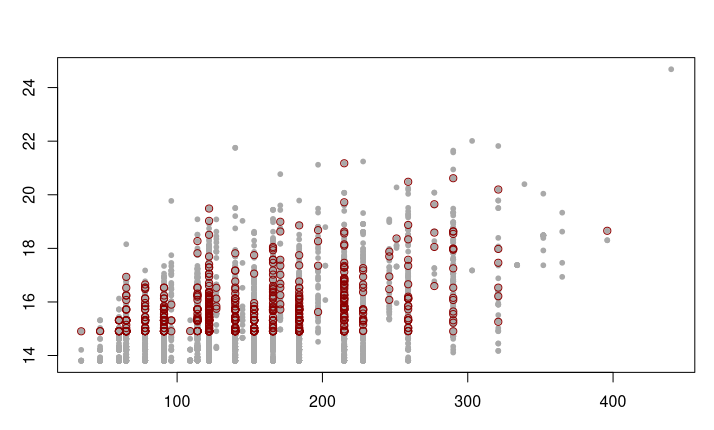
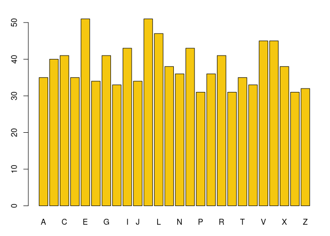

----

**Abstract**

The data structure of key-value stores or associative arrays (computer science) come under different names in several programming languages, such as 'dictionary' (Python, Julia), 'hash' (Perl, Ruby, JavaScript), 'map' (Java, Haskell), or 'table' (Lua), etc. We will look at some R packages that provide this functionality.

----

## Introduction

The Collatz problem, aka the $3n+1$ -Problem, is an unsolved mathematical problem.

The problem is about sequences of numbers that are constructed according to a simple recursive law:

Start with any natural number $n > 0$;  
If $n$ is even, take $n/2$ next;  
If $n$ is odd, take $3n+1$ next.  
Repeat the procedure with the number obtained. Stop when $n=1$ is reached.

For example, starting with $n=7$ one gets the sequence

    7, 22, 11, 34, 17, 52, 26, 13, 40, 20, 10, 5, 16, 8, 4, 2, 1

Apparently, each such sequence will at some point generate a power of 2
and then end with ...,4,2,1, regardless of the start number 𝑛. That is, there is no such sequence that is infinite or goes into a cycle without ever reaching 1.

The **collatz conjecture** is thus:

> Every sequence of numbers constructed in this way will end in 1,
> no matter with which natural number one starts.

----

## Some simple R code

*numbers* is a package with functions from number theory and has a generalized `collatz()` function. Here we will us a simplified version that takes a number `n` as input and generates the sequence as defined above. We assume the Collatz assumption is true, so after a finite number of steps we will reach 1 and stop.


```r
collatz <- function(n) {
    cseq <- c(n)
    while (n > 1) {
        if (n %% 2 == 0) n <- n / 2
        else n <- 3*n + 1
        cseq <- c(cseq, n)
    }
    cseq
}
```

We apply it to the number `n=7` as above:


```r
collatz(7)
```

```
##  [1]  7 22 11 34 17 52 26 13 40 20 10  5 16  8  4  2  1
```

We want to find numbers $n$ whose Collatz sequences are very long or reach very high numbers on their way down to 1. Let's write the results into a matrix with three columns, the number `n` , the length of the sequence, and its maximum.

```r
collatz_matrix <- function(N) {
    m <- length(N)
    C <- matrix(NA, nrow = m, ncol = 3)
    k <- 0
    for (n in N) {
        k <- k + 1
        cseq <- collatz(n)
        C[k, ] <- c(n, length(cseq), max(cseq))
    }
    C
}
```

So `N` is a set of (not secessarily sequential) natural numbers. We test it for the first 10 numbers. The following output shows that 𝑛=9 has a slightly longer sequence and at some point also runs into the number 52.

```r
collatz_matrix(1:10)
```

          [,1] [,2] [,3]
     [1,]    1    1    1
     [2,]    2    2    2
     [3,]    3    8   16
     [4,]    4    3    4
     [5,]    5    6   16
     [6,]    6    9   16
     [7,]    7   17   52
     [8,]    8    4    8
     [9,]    9   20   52
    [10,]   10    7   16

----

## Storing intermediate results

We would like to find longer sequences for numbers up to, say, one million, also storing the intermediate results like sequences calculated, their length and maximum. A matrix (or even a date frame) does not seem a perfect place for this.

So we will load the sequences in a key-value store and length and maximum in a column-oriented database (for later statistical calculations). As database we chhose the SQLite database through the R package RSQLite (unfortunately, MonetDBLite is not on CRAN anymore).

For key-value stores the following packages provide implementations:

  * *hash*
  * *filehash*
  * *fastmap*
  * *rredis*

*hash* uses R environments to implement key-value pairs as variable names and values. *filehash* implements keys (as S4 objects) with values as serialized objects stored on disc. *fastmap* stores keys as C++ objects and values as R lists. *rredis* connects to **Redis**, an open-source, in-memory data store (that has to be installed by the user independently of R).

We will look at all these possibilities and also at their timings.


### The 'hash' package

For the *hash* package, `H <- hash()` generates a hash, `H[[<key>]] <- <value>` will store a value for a key (which has to be a string), and `H[[<key>]]` will retrieve the value for that key.

Besides that, there are `clear` and `delete` methods to remove all or specific key-values. `keys` returns all keys as a character vector, and `values` all values. Values can also be set or retrieved with the `$` operator, seting it to `NULL` removes the key-value pair.

```r
H <- hash::hash()

N <- 50000
for (n in 1:N) {
  cseq <- collatz(n)
  H[[as.character(n)]] <- cseq
}
```

    Error: protect(): protection stack overflow

So we get a "protection stack overflow" showing that this is not the right key-value store for our task. (I was not able to let this run with more than 50000 objects where it took 5.5 seconds.)


### The 'filehash' package

The *filehash* package provides a disk-based approach. `dbCreate()` generates a name for the hash file, `dbInit` associates it with a file on the disk. `dbInsert()` and `dbFetch()` set and get the values for keys.

```r
filehash::dbCreate("collatz.db")
cdb <- filehash::dbInit("collatz.db")

N <- 1000000
for (n in 1:N) {
  cseq <- collatz(n)
  filehash::dbInsert(cdb, as.character(n), cseq)
}
dbUnlink(cbd)
```

A rough estimation of the time for inserting a key-value pair may be $5\cdot 10^{-4}$ seconds, and the size of the file on disk is about 1.2 GB. With `dbUnlink(cbd)` the file will be erased from disk.

An overview of the available functions for handling `filehash` stores:

    library(filehash)
    dbCreate(<filename>)        # file-based hash table
    db <- dbInit(<filename>)    # initialize the connection
    dbLoad(db)                  # assign a store again
    dbInsert(db, "key", value)  # or: db[[key]] <- , db$'key' <- 
    value <- dbFetch(db, key)   # or: db[[key]], db$'key'
    dbExists(db, key)
    dbDelete(db, key)
    dbList(db)                  # list all keys
    dbUnlink()                  # delete the database from disk
    

### The 'fastmap' package

While `filehash` is wriite in pure R, `fastmap` has a C++ implementation.

The *fastmap* package provides a quite easy and elegant interface for use. `H<-fastmap()` will create a hash, and `H$set(<key>, <value>)`, `H$get()`, etc., have the expected meaning.

```r
H <- fastmap::fastmap()

N <- 1000000
for (n in 1:N) {
  cseq <- collatz(n)
  H$set(as.character(n), cseq)
}
```

This takes about 180 secs on my machine. Given that the loop and running the `collatz` function for all these numbers takes 90 secs, we would have about $1 \cdot 10^{-4}$ seconds for each `set` operation.

An overview of the available functions for handling `filehash` stores:

    library(fastmap)
    db <- fastmap(NULL)         # or: missing_default = 0
    db$set(key, value)          # also: mset
    db$get(key)                 # also: mget; missing = <default>
    db$has(keys)
    db$remove(keys)
    db$size()                   # no. of items in the set
    db$as_list(db)              # returns a named list
    db$reset()                  # clear all items, reset the store


### The 'rredis' package

Redis is an open source, in-memory data structure store and can be used as a (non-relational) key-value database. Redis supports different kinds of abstract data structures, such as strings, lists, maps, sets, sorted sets, etc. It is quite suited for storing time series data.

The *rredis* package provides an R client interface to Redis. It is assumed that the user has installed the Redis software, and that the `redis` command is lited in the "path".

To be done.

----

## Using a relational database

### Storing max and length

For each $n$ we want to store the length and maximum of its Collatz sequence in a relational database. Unfortunately, *MonetDBLite* has been removed from CRAN and *MonetDB* requires the **Monet** database system to be installed by the user. Therefore we go back to SQLite.

```r
library(DBI)
library(RSQLite)
# ':memory:' in-memory database
con <- dbConnect(RSQLite::SQLite(), dbname = ":memory:")
rs <- dbSendQuery(con,
    "CREATE TABLE Collatz (n INTEGER, imax INTEGER, ilen INTEGER)")
dbClearResult(rs)
```

To verify we list the table(s) and its field(s).

```r
dbListTables(con)
dbListFields(con, "Collatz")
dbReadTable(con, "Collatz")
```
    [1] "Collatz
    [1] n    imax ilen
    <0 rows> (or 0-length row.names)

We are ready to scan all Collatz sequences and fill the database for a set $N$ of natural numbers.

```r
collatz_filldb <- function(N) {
    for (n in 1:N) {
        cseq <- H$get(as.character(n))
        imax <- max(cseq); ilen <- length(cseq)
        rs <- dbSendQuery(con,
                  paste("INSERT INTO Collatz VALUES (",
                        n, ",", imax, ",", ilen, ")", sep = ""))
        dbClearResult(rs)
    }
}
```

```r
N <- 1000000
collatz_filldb(N)
dbDisconnect()
```

This takes about 320 elapsed seconds, that is $2 \cdot 10^{-4}$ seconds per database operation.

### Example evaluations

Now we can look at some results. For example, which numbers have the highest maximum in our range $1 ... 10^6$? We can see that some of them do have a maximum of over 50 Billion.

```r
rs <- dbSendQuery(con,
          "SELECT * FROM Collatz WHERE imax >= 50000000000")
ans <- dbFetch(rs)
dbClearResult(rs)

ans
```

           n        imax ilen
    1 665215 52483285312  442
    2 704511 56991483520  243
    3 886953 52483285312  445
    4 997823 52483285312  440

And what are the numbers with the longest sequences?

```r
rs <- dbSendQuery(con,
          "SELECT * FROM Collatz WHERE ilen >= 500")
ans <- dbFetch(rs)
dbClearResult(rs)

ans
```
           n       imax ilen
    1 626331 7222283188  509
    2 704623 7222283188  504
    3 837799 2974984576  525
    4 939497 7222283188  507

### Example plots

We take a look at the last 10000 of our numbers ...

```r
rs <- dbSendQuery(con,
          "SELECT * FROM Collatz WHERE n >= 990001")
m <- dbFetch(rs)
dbClearResult(rs)

dbDisconnect(con)
```

... and plot length vs. maximum in gray, and as red circles all prime numbers among those numbers.

```r
par(mar = c(3,3,3,1))
plot(m$ilen, log(m$imax), col = "darkgray", pch = 20)

pinds <- numbers::isPrime(m$n)
points(m$ilen[pinds], log(m$imax[pinds]), col = "darkred")
```


----

## Efficiency considerations

It does not seem necessary to recalculate the whole Collatz sequence in every case. For instance, if $n$ is even then we have already generated the sequence for $n/2$ and can simply reuse that. This calls for a combination of storing and computing,

```r
H <- fastmap::fastmap()
H$set('1', c(1)); H$set('2', c(2,1))
nxt <- function(n) {
    if (n %% 2 == 0) n/2 else 3*n + 1
}

for (n in seq(3,1000000)) {
    if (n %% 2 == 0) {
        cseq <- c(n, H$get(as.character(n/2)))
    } else {
        m <- 3*n + 1
        cseq <- c(n, m)
        while (m >= n) {
            m <- nxt(m)
            cseq <- c(cseq, m)
        }
        cseq <- c(cseq, H$get(as.character(m))[-1])
    }
    H$set(as.character(n), cseq)
}
```

This takes about 20 seconds while the version with *fastmap* takes 180 seconds. Intermediate versions -- where we look up keys to find out whether they have already been calculated -- take about 60 seconds.

----

## Appendix: Write your own 'hash' functions

It's not that difficult to write one's own *hash* package. In the following implementation the key-value pairs are stored as variable names and their values in an underlying environment.

### Define hash functions


```r
def.h <- function() new.env(hash=TRUE, parent=emptyenv())
len.h <- function(dict) length(ls(envir=dict))
set.h <- function(key, val, dict) assign(as.character(key), val, envir=dict)
get.h <- function(key, dict, default=NULL) {
	key <- as.character(key)
    if (exists(key, envir=dict)) { get(key, dict)
    } else { default }
}
del.h <- function(key, dict) {
	key <- as.character(key)
    if (exists(key, envir=dict)) {
        val <- get.h(key, dict)
        rm(list=c(key), envir=dict)
    } else {
        val <- NULL
    }
    invisible(val)
}
has_key <- function(key, dict) exists(as.character(key), envir=dict)
keys.h <- function(dict) ls(envir=dict)
items.h <- function(dict) as.list(dict)
values.h <- function(dict, mode='character') {
    l <- as.list(dict)
    n <- length(l)
    if (n==0) invisible(NULL)
    v <- vector('character', n)
    for (i in 1:n) v[i] <- l[[i]]
    if (mode=='numeric') v <- as.numeric(v)
    return(v)
}
clear.h <- function(dict) {
    rm(list=keys.h(dict), envir=dict)
}
```

### Define a counter


```r
counter <- def.h()              # define a hash counter ... and count
count <- function(x, hash = counter) {
  set.h(x, get.h(x, counter, default=0) + 1, counter)
}
```

### Counting example


```r
C = sample(LETTERS, 1000, replace = TRUE)
for (ch in C) count(ch, counter)

Cdf = data.frame(Letter = keys.h(counter),
                 Number = as.numeric(values.h(counter)))
head(Cdf)
```

```
##   Letter Number
## 1      A     35
## 2      B     40
## 3      C     41
## 4      D     35
## 5      E     51
## 6      F     34
```


```r
par(mar = c(3,3,2,1))
barplot(Cdf$Number, names.arg = Cdf$Letter,
        col = 7)
```

<!-- -->

As it turns out, this implementation is more efficient than the one in the *hash* package.

----

## References

[Horner] Jeffrey Horner. "Hash Table Performance in R: Parts I-IV". R-bloggers 2015.

[Part I](https://jeffreyhorner.tumblr.com/post/114524915928/hash-table-performance-in-r-part-i) |
[Part II](https://jeffreyhorner.tumblr.com/post/116325104028/hash-table-performance-in-r-part-ii-in-part-i) |
[Part III](https://jeffreyhorner.tumblr.com/post/116690418898/hash-table-performance-in-r-part-iii-in-part) |
[Part IV](https://jeffreyhorner.tumblr.com/post/117059271933/hash-table-performance-in-r-part-iv)
