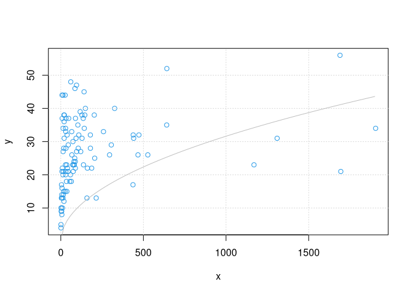

## 1.0 Parameterschätzung mit `nls()`

Während `lm()` lineare 'least-squares' Regression behandelt, steht in Base R die Funktion `nls()` für nichtlineare Regression zur Verfügung.

Siehe das [Optimization Cheatsheet](https://github.com/hwborchers/CheatSheets/blob/main/Base%20R%20Optim%20Cheatsheet.pdf) von J. Nash und H.W. Borchers.

### 1.1 Beispiel: Gedämpfte Schwingung

Wir beginnen mit einem einfachen Beispiel, den künstlichen Daten einer gedämpften Schwingung.


```r
set.seed(9973)
x = seq(0, 1, len = 50)
y = 1.2 * exp(-0.9*x) * sin(0.7 + 20*x) + 0.2*rnorm(50)
```


```r
plot(x, y, col = 4)
grid()
```

<!-- -->

Wir wollen die Parameter der gedämpften Schwingung rekonstruieren. Die allgemeine Gleichung dafür lautet

    y = a + b e^(-k x) sin(c + d x)

Mit dieser Modellgleichung rufen wir die Funktion `nls()` auf mit gewissen Startparametern. Um eine Fehlermeldung zu vermeiden, müssen wir `b4` von 1 auf 10 setzen.


```r
frm = y ~ b1 * exp(-b2*x) * sin(b3 + b4*x)
mdl = nls(formula = frm,
          data = list(x = x, y = y),
          start = c(b1 = 1, b2 = 1, b3 = 1, b4 = 10))
mdl
```

```
## Nonlinear regression model
##   model: y ~ b1 * exp(-b2 * x) * sin(b3 + b4 * x)
##    data: list(x = x, y = y)
##      b1      b2      b3      b4 
##  1.3163  1.1799  0.7221 20.0471 
##  residual sum-of-squares: 1.728
## 
## Number of iterations to convergence: 11 
## Achieved convergence tolerance: 9.178e-06
```

Es ist in jedem Fall gut, dieses Ergebnis genau anzuschauen: Sind die Parameter vernünftig, wie gross ist die Summe der Quadrate der Residuen, ist die Konvergenz überzeugend?

Wie kann man die Parameter aus dem Model herausziehen und Werte mit dem Model vorhersagen?


```r
coef(mdl)
```

```
##         b1         b2         b3         b4 
##  1.3163473  1.1798725  0.7220837 20.0471387
```

```r
# dial(coef(mdl))
# yp = b1 * exp(-b2 * x) * sin(b3 + b4 * x)
```


```r
plot(x, y, col = 4)
lines(x, 1.2 * exp(-0.9*x) * sin(0.7 + 20*x))
lines(x, predict(mdl, newdata = x), col = 2, lwd = 2)
grid()
```

<!-- -->

Was sind gute Kennzahlen, um die Qualität der angepassten Punkte zu beurteilen?


```r
pracma::rmserr(y, predict(mdl), summary = TRUE)
```

```
## -- Error Terms --------------------------------------------------
##  MAE:   0.1368   	- mean absolute error (in range [ -1.153971 1.378977 ])
##  MSE:   0.0346   	- mean squared error (the variance?!)
##  RMSE:  0.1859   	- root mean squared error (std. dev.)
##  MAPE:  0.6345   	- mean absolute percentage error
##  LMSE:  0.0919   	- normalized mean squared error
##  rSTD:  1.5681   	- relative standard deviation ( 0.1185403 )
## -----------------------------------------------------------------
```

### 1.2 Wahl der Startparameter

Wie andere Optimierungsalgorithmen auch kann 'nls()' in lokalen Minima hängen bleiben. Das Energebnis hängt daher stark von den gegebenen Startparametern ab. In vielen Fällen hat der Nutzer auch keine Vorstellung davon, was geeignete Startparameter sein könnten.


```r
df12 = read.table("data/potfun.csv", header = TRUE, sep = ',')
with(df12, {plot(x, y, col = 4); grid()})
curve(sqrt, 0, 1900, col = "gray", add = TRUE)
```

<!-- -->

Wir benutzen die Funktion `nls2` im Paket 'nls2'. Dort können wir Bereiche für die Startparameter angeben und nach den besten Startparametern suchen lassen.


```r
library(nls2)
```

```
## Loading required package: proto
```


```r
mdl1 = nls2(formula = y ~ b1 + b2 * (x ^ b3),
            data = df12,
            start = data.frame(b1 = c(-100, 100),
                               b2 = c(-100, 100),
                               b3 = c(-1.0, 1.0)),
            algorithm = "grid-search",            # random-search
            all = FALSE)
mdl1
```

```
## Nonlinear regression model
##   model: y ~ b1 + b2 * (x^b3)
##    data: df12
##       b1       b2       b3 
##  33.3333 -33.3333  -0.3333 
##  residual sum-of-squares: 10078
## 
## Number of iterations to convergence: 64 
## Achieved convergence tolerance: NA
```

Um dieses Ergebnis zu verfeinern, ruft man `nls2()` noch ein zweites mal auf, diesmal mit den Parametern der ersten Suche als Startparameter.


```r
mdl2 = nls2(formula = y ~ b1 + b2 * (x ^ b3),
            data = df12,
            start = mdl1)
mdl2
```

```
## Nonlinear regression model
##   model: y ~ b1 + b2 * (x^b3)
##    data: structure(list(x = c(1.17, 1.18, 1.71, 2.43, 3.69, 3.71, 4.51, 5.4, 6.27, 6.48, 6.93, 7.29, 7.56, 7.99, 8.6, 9.54, 10.3, 12.6, 13.37, 13.47, 13.57, 14.09, 14.49, 15.03, 18.04, 18.89, 19.26, 19.61, 20.45, 20.45, 21.22, 26.22, 27.52, 28.46, 28.91, 29.52, 30.36, 30.7, 31.43, 31.83, 34.27, 36.03, 36.61, 38.52, 40.21, 44.09, 45.16, 47.7, 54.39, 58.27, 60.47, 63.84, 66.15, 67.13, 72.28, 73.47, 75.19, 76.41, 79.88, 82.24, 84.38, 85.86, 87.57, 88.23, 88.88, 92.33, 95.23, 96, 103.38, 105.76, 109.08, 117.24, 120.76, 127.84, 128.68, 135.92, 137.38, 140.92, 142.27, 145.31, 148.93, 158.31, 161.15, 178.99, 179.36, 187.05, 202.66, 205.3, 214.36, 258.42, 295.21, 305.75, 325.78, 436.97, 438.25, 441.01, 467.24, 472.78, 526.68, 640.88, 641.76, 1169.11, 1309.1, 1689.67, 1694.32, 1905.16), y = c(4L, 5L, 10L, 9L, 13L, 10L, 17L, 9L, 14L, 8L, 13L, 16L, 21L, 44L, 37L, 22L, 10L, 20L, 13L, 44L, 34L, 27L, 21L, 14L, 28L, 15L, 12L, 38L, 36L, 31L, 38L, 44L, 15L, 23L, 34L, 20L, 33L, 21L, 28L, 37L, 18L, 23L, 15L, 32L, 22L, 21L, 29L, 37L, 18L, 20L, 48L, 18L, 33L, 26L, 23L, 30L, 21L, 23L, 24L, 23L, 25L, 46L, 24L, 22L, 37L, 31L, 47L, 27L, 35L, 28L, 32L, 39L, 27L, 38L, 31L, 37L, 23L, 45L, 34L, 38L, 40L, 13L, 22L, 32L, 28L, 22L, 38L, 25L, 13L, 33L, 26L, 29L, 40L, 17L, 32L, 31L, 26L, 32L, 26L, 35L, 52L, 23L, 31L, 56L, 21L, 34L)), class = "data.frame", row.names = c(NA, -106L))
##       b1       b2       b3 
##  33.9291 -33.4595  -0.4464 
##  residual sum-of-squares: 8751
## 
## Number of iterations to convergence: 3 
## Achieved convergence tolerance: 3.04e-06
```

Passt dieses Ergebnis in unser Bild?


```r
with(df12, {plot(x, y, col = 4); grid()})
lines(df12$x, predict(mdl2), col = 2)
```

<!-- -->

## 2.0 Parameterschätzung mit `nlxb()`

### 2.1 Beispiel: Exponentieller Abfall


```r
df21 = read.table("data/tempdata.csv", header = TRUE, sep = ',')
time = df21$time; temp = df21$temp
plot(time, temp, col = 4, main = "Temperaturdaten")
grid()
```

<!-- -->

Physikalisch folgt dies dem **Newtonschen Abkühlungsgesetz**

    temp = T0 + a e^(-k time)

mit `T0` der Umgebungstemperatur, `a` die Abkühlungskonstante und `k` ein Proportionalitätsfaktor.


```r
try(nls(formula = temp ~ T0 + a * exp(-k * time),
        data = df21,
        start = c(T0 = 20, a = 1.0, k = 0.01))
)
```

```
## Error in nls(formula = temp ~ T0 + a * exp(-k * time), data = df21, start = c(T0 = 20,  : 
##   singular gradient
```

Und da ist die Fehlermendung: "singular gradient". (Merkwürdigerweise können wir den Fehler vermeiden, indem wir `k` durch `1/k` ersetzen.)

### 2.2 Das Paket 'nlsr'

Es gibt zwei Alternativen zu `nls()`, in den Paketen 'minpack.lm' und 'nlsr'. Ich empfehle das von John Nash mit grosser Sorgfalt implementierte 'nlsr' mit den Funktionen `nlxb()` und `nlfb()`.


```r
library(nlsr)
mdl = nlxb(formula = temp ~ T0 + a * exp(-k * time),
          data = df21,
          start = c(T0 = 20, a = 1.0, k = 1))
```

```
## vn:[1] "temp" "T0"   "a"    "k"    "time"
## no weights
```

```r
mdl  # oder: summary(mdl)
```

```
## nlsr object: x 
## residual sumsquares =  10.548  on  52 observations
##     after  24    Jacobian and  33 function evaluations
##   name            coeff          SE       tstat      pval      gradient    JSingval   
## T0               40.6078         1.184       34.3  6.459e-36   1.677e-10       22600  
## a                51.4093         1.087      47.28  1.505e-42  -6.223e-11       3.962  
## k             0.00486758      0.000189      25.76  3.853e-30   2.521e-07      0.2894
```

Wir erhalten eine Umgebungstemperatur `T0 = 40` Grad und eine Konstante `k = 0.0049`.

Wie hoch war die Temperatur 10 sec vor Beginn der Messungen?


```r
predict(mdl, list(time = -10))
```

```
## [1] 94.581
## attr(,"class")
## [1] "predict.nlsr"
## attr(,"pkgname")
## [1] "nlsr"
```

Oder wir benutzen die Koeffizienten, um die Lösung als Funktion zu definieren.


```r
cf = coefficients(mdl); cf
```

```
##         T0          a          k 
## 40.6077927 51.4093018  0.0048676 
## attr(,"pkgname")
## [1] "nlsr"
```

```r
dial(cf)
```

```
## T0 = 40.608 
## a = 51.409 
## k = 0.0048676
```


```r
ftemp = function(time) T0 + a * exp(-k * time)

plot(time, temp, col = 4, main = "Temperaturdaten", 
     xlim = c(0, 350), ylim = c(45, 95))
curve(ftemp, 0, 350, add = TRUE, col = 2)
grid()
```

<!-- -->


```r
uniroot(function(t) ftemp(t) - 50, c(0, 1000))$root
```

```
## [1] 349.24
```

### 2.3 Beschränkungen der Parameter

`nls()` und `nlxb()` erlauben die Formulierung von "box/bound constraints", also Beschränkungen der Art `l[i] <= b[i] <= u[i]` für die Parameter `b[i]` des Modells.

Nehmen wir an, wir suchen eine Lösung des Temperaturmodells, in dem die Umgebungstemperatur höchstens 30 Grad beträgt.


```r
mdl = nlsr::nlxb(formula = temp ~ T0 + a * exp(-time / th),
                 data = df21,
                 start = c(T0 = 20, a = 1.0, th = 100.0),
                 lower = c(0, 0, 10), upper = c(30, 100, 500)
                 # für nls():
                 # , algorithm = "port"
)
```

```
## vn:[1] "temp" "T0"   "a"    "time" "th"  
## no weights
```

```r
mdl
```

```
## nlsr object: x 
## residual sumsquares =  20.417  on  52 observations
##     after  8    Jacobian and  9 function evaluations
##   name            coeff          SE       tstat      pval      gradient    JSingval   
## T0                    30U           NA         NA         NA           0       5.008  
## a                61.2406            NA         NA         NA   6.088e-11       0.264  
## th               276.527            NA         NA         NA    -4.1e-11           0
```

## 3.0 Andere Implementationen

### 3.1 MINPACK Software

Das Paket 'minpack.lm' ermöglicht den Zugriff auf die NIMPACK Bibliothek zur Lösung nichtlinearer LS Probleme über die Funktion `nlsLM`. Der Aufruf ist nahezu identisch mit dem von `nls()`.

Hier ein einfache Beispiel mit Daten, die einer logistischen Kurve folgen. Die mathematische Beschreibung dafür lautet

    f(x) = L / (1 + exp(-k * (x-x0)))

`L` die maximale Sättigung, `x0` der Punkt des Richtungswechsels und `k` die Steigung in diesem Punkt.


```r
df31 <- read.csv("data/example1.csv")

with(df31, {plot(x, y, col = 4); grid()})
```

<!-- -->


```r
library(minpack.lm)
```


```r
mdl = nlsLM(formula = y ~ p1 / (1 + exp(-p2*(x - p3))),
            data = df31,
            start = c(p1 = 100, p2 = 50, p3 = 0.5))
mdl
```

```
## Nonlinear regression model
##   model: y ~ p1/(1 + exp(-p2 * (x - p3)))
##    data: df31
##     p1     p2     p3 
## 91.332  4.700  0.513 
##  residual sum-of-squares: 396
## 
## Number of iterations to convergence: 9 
## Achieved convergence tolerance: 1.49e-08
```

`mdl` ist von der Klasse "nls" und erlaubt deshlab die gleichen S3 Methoden wie etwa `coef`, `resid` oder `predict`.


```r
with(df31, {plot(x, y, col = 4); grid();
            lines(x, predict(mdl, x), col = 2)})
```

<!-- -->

Ein Vorteil des 'minpack.lm' Paketes ist, dass es auf in C implementierte Codes zurückgreifen kann und dadurch in manchen Fällen sehr viel schneller ist.

### 3.2 Kurvenanpassung in 'pracma'

In 'pracma' gibt es die entsprechende Funktion `lsqcurvefit()`, die ebenfalls den Levenberg-Marquardt Algorithmus implementiert. Diese Funktion akzeptiert keine Formeln, das Modell muss daher als Funktion beschrieben werden.


```r
library(pracma)
```


```r
fn = function(p, x) p[1] / (1 + exp(-p[2]*(x - p[3])))
p0 = c(100, 50, 0.5)

mdl = lsqcurvefit(fn, p0, df31$x, df31$y)
p = mdl$x; p
```

```
## [1] 91.33205  4.70011  0.51255
```

Das sind die gleichen Parameter wie zuvor. Wir verzichten auf den entsprechenden Plot.

### 3.3 Funktionen statt Formeln

Das Paket 'nlsr' erlaubt auch Funktionen statt Formeln für die nichtlineare Regression zu nutzen. Dafür steht die Funktion `nlfb` bereit, die typischerweise wie folgt aufgerufen wird:


```r
x = df31$x; y = df31$y
resfn = function(p) p[1] / (1 + exp(-p[2]*(x - p[3]))) - y
start = c(p1 = 100, p2 = 50, p3 = 0.5)

mdl = nlsr::nlfb(start, resfn)
```

```
## no weights
```

```r
mdl
```

```
## nlsr object: x 
## residual sumsquares =  396  on  50 observations
##     after  10    Jacobian and  15 function evaluations
##   name            coeff          SE       tstat      pval      gradient    JSingval   
## p1               91.3321         1.064      85.85  2.567e-53  -1.405e-09       385.9  
## p2               4.70011        0.1882      24.98  8.883e-29   1.073e-08       20.44  
## p3              0.512555        0.0107       47.9  1.516e-41  -1.811e-08        2.71
```

Bevor die Funktion `resfn` definiert werden kann, müssen die Daten `x` und `y` bekannt sein. Interessant sind hier die statistischen Kennzahlen, die mitberechnet werden.

Auch das Paket 'minpack.lm' verfügt über eine solche Funktions-Schnittstelle in `nls.lm`.


```r
mdl = nls.lm(start,
             lower = NULL, upper = NULL,
             resfn)
mdl
```

```
## Nonlinear regression via the Levenberg-Marquardt algorithm
## parameter estimates: 91.3320594104306, 4.70011043724395, 0.512555009597008 
## residual sum-of-squares: 396
## reason terminated: Relative error in the sum of squares is at most `ftol'.
```

In diesem Fall ist "nls.lm" die Klasse des Resultates mit leicht unterschiedlichen Komponenten, so werden die Koeffizienten / Parameter mit `mdl$par` zurückgegeben.

Diese beiden Funktionen können auch noch die Jacobische der Modellfunktion aufnehmen und verarbeiten. Die Formulierung der Jacobischen ist allerdings etwas komplitierter.

## 4.0 Kurvenanpassung in Julia

### 4.1 Beispiel: Radioaktive Strahlung

Das folgende Beispiel künstlicher/artifizieller Daten ist ein bekannter Testfall für nichtlineare Parameterschätzung.

Gemessen wird die radioaktive Strahlung einer Probe, die () drei verschiedenen radioaktive Zerfallsprodukte enthält. Ziel ist die Bestimmung der Halbwertszeiten und damit die Bestimmung der verschiedenen Stoffe.


```r
#   Lanczos1 data (artificial data)
#   f(x) = 0.0951*exp(-x) + 0.8607*exp(-3*x) + 1.5576*exp(-5*x)
x <- seq(0, 1.15, length.out = 24)
y <- c(2.51340000, 2.04433337, 1.66840444, 1.36641802, 1.12323249, 0.92688972,
       0.76793386, 0.63887755, 0.53378353, 0.44793636, 0.37758479, 0.31973932,
       0.27201308, 0.23249655, 0.19965895, 0.17227041, 0.14934057, 0.13007002,
       0.11381193, 0.10004156, 0.08833209, 0.07833544, 0.06976694, 0.06239313)

plot(x, y, col = 4); grid()
```

<!-- -->

### 4.2 Berechnung in Julia

Wir wollen das mit Hilfe einer Julia Implementierung des Levenberg-Marquardt Algorithmus lösen -- im Julia Paket 'LsqFit' -- und benutzen für den Zugriff auf Julia Funktionen das R Paket 'JuliaCall'.


```r
library(JuliaCall)
julia_library("LsqFit")  # using LsqFit
```

```
## Julia version 1.5.3 at location /usr/bin will be used.
```

```
## Loading setup script for JuliaCall...
```

```
## Finish loading setup script for JuliaCall.
```


```r
julia_assign("x", x)
julia_assign("y", y)
julia_assign("p0", c(1.0, 1.0, 1.0, 1.0, 1.0, 1.0))
```


```r
julia_command(
  "@. model(x, p) = p[1]*exp(-p[2]*x) + p[3]*exp(-p[4]*x) + p[5]*exp(-p[6]*x);")
julia_command("fit = curve_fit(model, x, y, p0);")

( p = julia_eval("fit.param") )
```

```
## [1] 0.860700 2.999998 1.557601 5.000000 0.095099 0.999997
```

Wie gross die Genauigkeit dieser Lösung ist, kann man am besten sehen an der "Summe der Quadrate" der Residuen.


```r
sum((p[1]*exp(-p[2]*x) + p[3]*exp(-p[4]*x) + p[5]*exp(-p[6]*x) - y)^2)
```

```
## [1] 1.2309e-16
```

Das ist ziemlich gut und wohl in einer "double float" Arithmetik nicht mehr zu verbessern. Allerdings fordert NIST eine Genauigkeit von `1e-24`.

## 5.0 Ausblick: Moderne Methoden

Hier ist ein Beispiel, die Anzahl der Individuen einer biologischen Art innerhalb eines geschützten Territoriums.


```r
df50 = read.table("data/preypred.csv", sep = ',', header = TRUE)
time = df50$time; prey = df50$prey

plot(time, prey, col = 4); grid()
```

<!-- -->

Dies ist offensichtlich eine Art Schwingung, aber keine Sinus-Schwingung. Der Versuch, sie durch ein Model einer Sinuskurve darzustellen, führt zu unbefriedigenden Ergebnissen.

### 5.1 Gauss'sche Prozesse

**Gauss'sche Prozesse** ist eine neue Form des nicht-parametrischen, nicht Model-gebundenen Maschinellen Lernens, die sich für Regressionen wie für Klassifikationsaufgaben einsetzen lassen. Das Paket 'GauPro' stellt eine solche Möglichkeit zum Fitten nichtlinearer Kurven zur Verfügung.


```r
library(GauPro)
gp = GauPro(time, prey, parallel = TRUE)
gp
```

```
## GauPro object of GauPr_Gauss
## 	D = 1, N = 101
## 	Theta =  0.00245 
## 	Nugget = 0.0155
## 	Run update to add data and/or optimize again
## 	Use pred to get predictions at new points
```


```r
plot(time, prey, col = 4); grid()

yfit = predict(gp, time)
lines(time, yfit, col = 2)

# Friedman's Supersmoother
ss = supsmu(time, prey)
lines(ss$x, ss$y, col = "gray", lwd = 2)
```

<!-- -->

Dies kann auch ganz einfach zur Gättung von Kurven/Signalen benutzt werden.

### 5.2 Scientific Machine Learning

Die obige Kurve repräsentiert die Anzahl der Indivuen einer biologischen Art in einem Habitat, die durch eine Räuberpopulation unter Druck steht. Dies wurde zum ersten Mal in den 1920er Jahren für Fischschwärme in der Adria beobachtet und kann durch die **Lottke-Volterra Gleichungen** beschrieben werden.

Sei `b(t)` die Anzahl der Beutetiere und `r(t)` die Anzahl der Raubtiere zum Zeitpunkt t, dann besagen diese Differenzialgleichungen für die Veränderung der Populationen

    db(t) = a1 b(t) - a2 b(t) r(t)
    dr(t) = a3 r(t) - a4 b(t) r(t)

Man wird also gerne aus den Populationszahlen der Beute und Räuber die Koeffizienten dieses Differenzialgleichungssystems bestimmen.

Solche Aufgaben der Kombination von Differenzialgleichungen und Methoden des Machinellen Lernens (oder das Lösen von komplexen Differentialgleichungen durch Methoden des **Deep Learning**) werden immer wichtiger und haben Anwendungen in Technik, Physik und Chemie, Epidemiologie, Ökonomie usw.

Siehe zum Beispiel [SciML.ai](https://sciml.ai).

## 6.0 References

[Nash2014]\
John C. Nash. "Nonlinear Parameter Optimization Using R Tools". John Wiley & Sons, UK 2014.

[Bloomfield2014]\
Victor A. Bloomfield. "Using R for Numerical Analysis in Science and Engineering". CRC Press/Taylor & Francis Group, Florida 2014.

[NIST_StRD]\
NIST StRD Nonlinear Least Squares Regression Datasets.\
<https://www.itl.nist.gov/div898/strd/nls/nls_main.shtml>

[NashBorchers2020]\
John C. Nash and H.W. Borchers. "Base R Optimization Cheat Sheet".\
<https://github.com/hwborchers/CheatSheets/blob/main/Base%20R%20Optim%20Cheatsheet.pdf>

[Theussl2020]\
St. Theussl, F. Schwendinger, H.W. Borchers. "CRAN Task View: Optimization and Mathematical Programming".\
<https://cran.r-project.org/view=Optimization>
