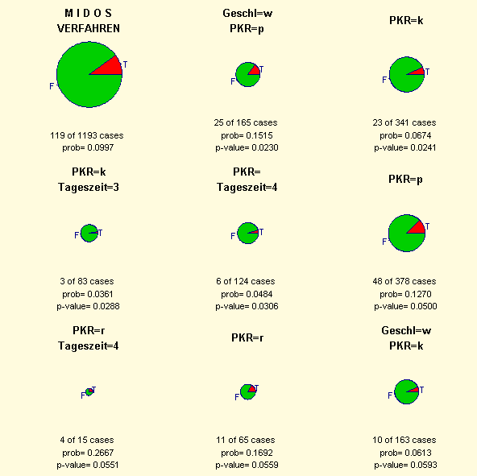
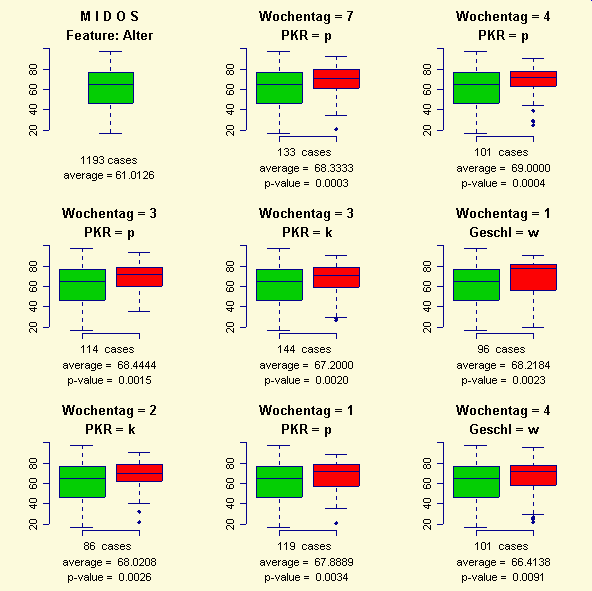
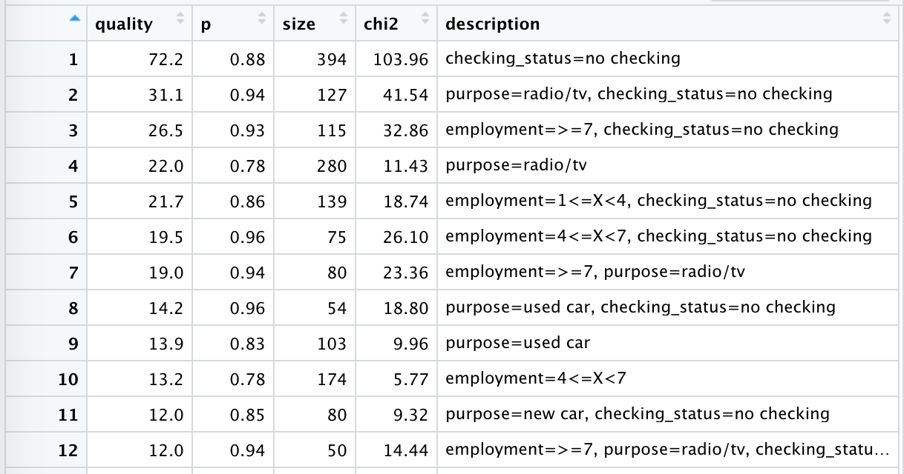
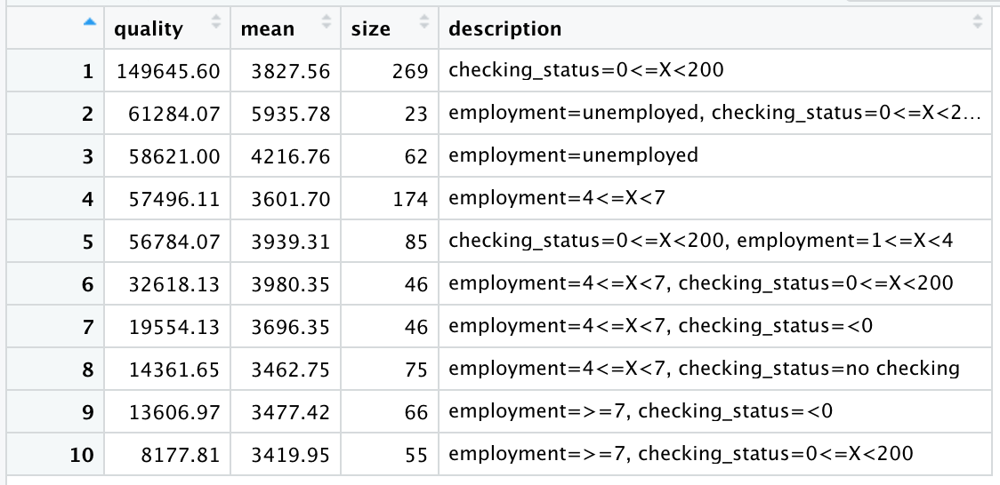
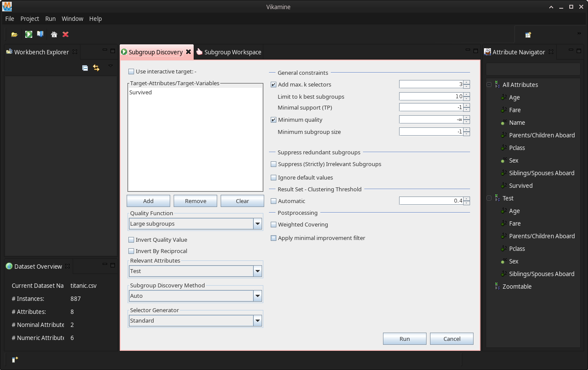
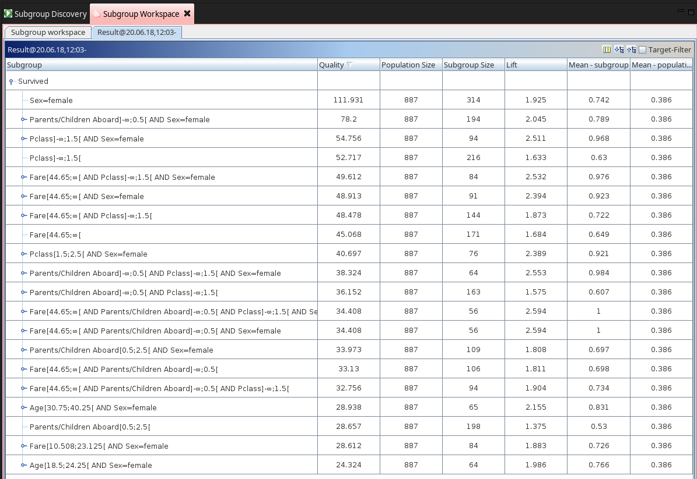
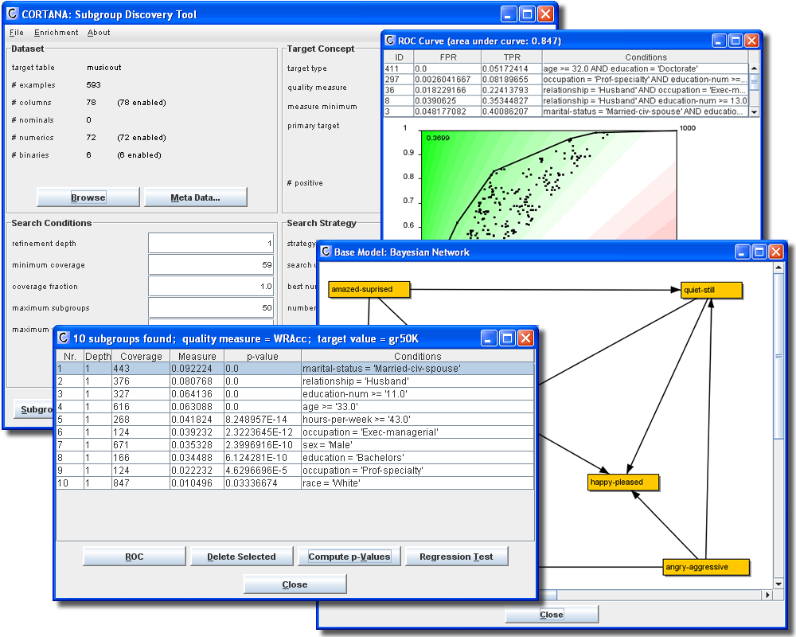

## Subgroup Discovery Systems

* **EXPLORA** (Klösgen, 1996)

* **MIDOS** (Wrobel, 1997)

* **MIDOS** (Wrobel, 2001)  
  Integrated in the Data Mining Tool KEPLER (Fa. Dialogis)

* **VIKAMINE** (Atzmüller, 2005)  

* *rsubgroup* CRAN package

* *pysubgroup* (Python, pandas)  

* KNIME, Orange (free), KEEL, RapidMiner (comm)


## Descriptive rules

**Examples**

- The unemployment rate is above average for young men  
  with a low educational level

- Smokers with a positive family history are at a significantly  
  higher risk for coronary heart disease

- While only 50% of all students passed the exam,  
  90% of all female students younger than 21 passed.

**Technical application**

Combinations of certain factors that cause a significant increase/decrease in the fault or repair rates of a product.


## Subgroups ... and rules

A *subgroup description* is given by a set of attributes  
${A_1, \ldots, A_m}$ and possible values $val_i, i=1, \dots, m$:

<div class="red">
$A_1 = val_1 \quad \mathrm{AND} \, ... \, \mathrm{AND} \quad A_m = val_m$
<p></p></div>

A **subgroup** is the set of all individuals that are  
'covered' by this *rule*.

EXAMPLE  
(w/ one binary, one discrete, and one numeric attribute):

    smoker = true and family_history true and age in [50, 70]


## What is "Subgroup Discovery" ?

The task of Subgroup Discovery is to discover / identify

* <div class="red">**subgroups**</div>
  of a given population that are statistically

* <div class="blue">**interesting**</div>
  with repect to a certain property (target).

WATCH OUT:  
The search space for all subgroups is exponential  
(concerning all features and their values) --  
therefore an efficient search strategy will be necessary.

Algorithms, e.g., *beam search* or *SD-Map*.


## Interestingness measures

**Quality** functions

- (*significance*) utilize the statistical distribution of the target concept to score/rank the subgroups found.

- (*coverage/support*) trade off the size of the subgroup and the deviation of the target from the average in the population.

**Example**

$$
  q_B = \frac{(t_p - t_0) \sqrt{n}}{\sqrt{t_0 (1 - t_0)}} \sqrt{\frac{N}{N - n}}
$$

$N$ population resp. $n$ subgroup size, $t_0$ resp. $t_p$ the target average in population and subgroup.


## Result presentations (MIDOS)




## Result presentations (MIDOS)




## 'rsubgroup' R package

- **rsubgroup** depends on *rjava* (and *foreign*)  
  i.e. Java >= 6 (?) needs to be installed

  if installing *rjava* throws an error, try  
  `> [sudo] R CMD javareconf`  
  (and restart RStudio!)

- Attributes need to be `numeric` or `factors`,  
  not characters

  The default has changed for R version 4.0, now  
  `read.table(..., stringsAsFactors = TRUE, ...)`  
  (also the `data` function is affected)


## Discrete targets

... with *categorical* target attribute:

```r
library(rsubgroup)
## Loading required package: rJava

data(credit.data)

df1 <- DiscoverSubgroups(
    source = credit.data,
    target = as.target("class", "good"),
    config = new("SDTaskConfig",
        attributes=c("checking_status", "credit_amount",
                     "employment", "purpose")),
    as.df = TRUE)

View(df1)
```


{width=790}


## Numerical target

... with *numerical* target attribute:

```r
library(rsubgroup)
## Loading required package: rJava

data(credit.data)

res <- DiscoverSubgroups(
    credit.data,
    as.target("credit_amount"),
    new("SDTaskConfig",
        attributes=c("checking_status", "employment")))

df2 <- ToDataFrame(res)
View(df2)
```


{width=790}


## Configuration options

The configuration will be changed through `SDConfigTask()` with the following options:

    method = c("sdmap", "bsd", "beam")

    qf = c("ps",            # Piatetsky-Shapiro
           "bin", "chi2",   # Binomial, Chi-Squared
           "gain", "lift",
           "wracc", ...)    # Weighted Relative Accuracy

    k = 20, maxlen = 7,     # no. subgroups, max no.conjunctions
    minqual, minsize        # minimal quality or subgroup size
    ...,                    # &c.
    postfilter = ""         # e.g. removes irrelevancy patterns
                            # or requires minimum improvements


## VIKAMINE

**VIKAMINE**

- is the Java software underlying the *rsubgroup* package;

- has its own graphical user interface (GUI);

- allows for many more options for the user;

- generates a much more readable result output.

Installation of VIKAMINE is relatively easy,  
provided the Java SDK is already installed on the computer  
(resp. Java 6 on macOS?).


{width=800}


{width=800}


## 'pysubgroup' usage

```python
import pysubgroup as ps

# Load the example dataset
from pysubgroup.tests.DataSets import get_titanic_data
data = get_titanic_data()

target = ps.BinaryTarget ('Survived', True)
searchspace = ps.create_selectors(data, ignore=['Survived'])
task = ps.SubgroupDiscoveryTask (
    data,
    target,
    searchspace,
    result_set_size=5,
    depth=2,
    qf=ps.WRAccQF())
result = ps.BeamSearch().execute(task)
```


## Cortana

Cortana is an open source Subgroup Discovery tool from LIACC.  
It can be used stand-alone or as a plug-in for KNIME.

{width=500}


## References

- For this talk, see <https://rpubs.com/hwborchers/>

- VIKAMINE: Subgroup Discovery and Analytics
  <http://www.vikamine.org>

- F. Herrera et al., "An overview of subgroup discovery:
  foundations and applications", Knowl Inf Syst 29 (2011)

- M. Boley: Subgroup Discovery.
  NOMAD Summer School, Berlin 2017  
  <https://www.youtube.com/watch?v=wlZ5jh6HpPE>

- Subgroup discovery in MOOCs: a big data application
  for describing different types of learners, 2019

